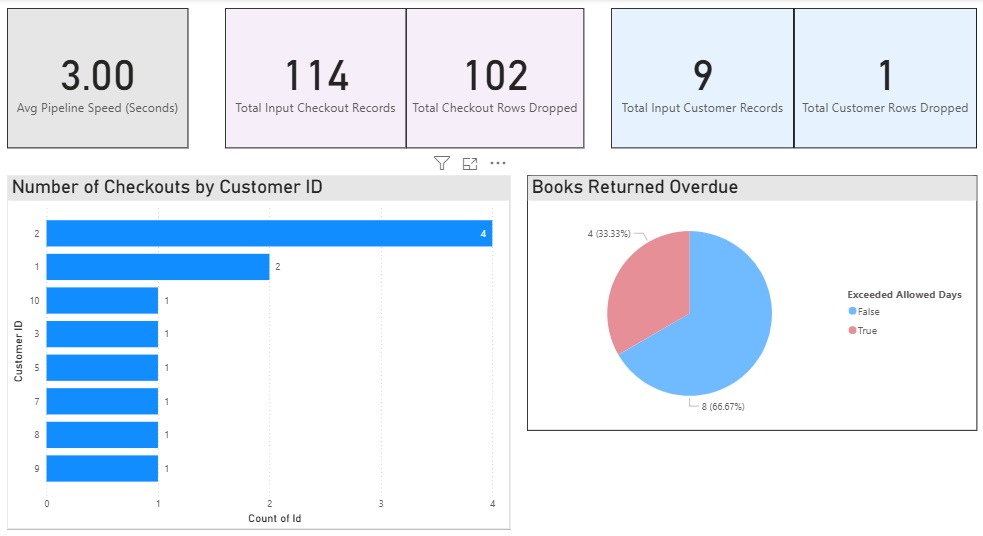

# 20260601-DE5M5
for data engineering apprenticeship module 5

## Scenario:
A library wants to replace its slow, manual spreadsheet reviews with an automated data pipeline. A brief inspection of the library's raw data shows severe data quality issues that make manual reporting unreliable. 

### Preliminary issues spotted
1. Erroneous dates e.g. 10/04/2063 and 32/05/2023
2. Similar to #1 there are some return dates listed as prior to checkout dates
3. Formatting issues such as dates being surrounded by excess speechmarks
4. Many blank rows at bottom of file
5. Duplicated entries e.g. Little Women which shows twice with all the same field values
6. Missing references e.g. The Hobbit was checked out to customer ID 4 but this was not in the customer data

Solution will be to automatically clean the data every time the data updates, ensuring that a reliable dataset is sent to Power BI for reporting. 

## User Stories
1. As a data analyst for the library I want to work with clean core data, without duplicate records, trailing blank spaces and extra speech marks so that the core dataset is clean.
2. As a data analyst for the library I want erronenous dates such as impossible dates and chronologically impossible dates filtered out so that that data is realistic.
3. As a data engineer I want a workflow to run automated tests and clean the data automatically so that zero manual effort is required. 
4. As a library manager I want clean and reliable data fed into a Power BI visual so that I can see accurate metrics.

## Solutions Diagram

## Steps tried:

### Day 1 - Initial exploration
- Initially ingested raw data using pandas dataframes in a local Jupyter notebook. 
- Isolated data errors using filters like dropna and drop_duplicates

### Day 2 - ETL
- Reformated the notebook format logic structured ETL functions to improve maintainability and support automated testing.
- Established a local warehouse storage tier by mapping pandas outputs to SSMS using SQLAlchemy and pyodbc. 

### Day 3 - feature engineering & API
- Built feature engineering logic to convert descriptive fields ("2 weeks") into clean numerical attributes, computed runtime metrics like 'Actual Days Checked Out' and an overdue flag. 
- Wrapped the ETL engine inside a FastAPI application
- Exposed the data pipeline over local HTTP network endpoints, moving execution from a manual local script run to a single web API request trigger (POST /trigger-etl).

### Day 4 - Automated auditing & Analytics
- Appended automated metadata capturing directly inside execution code block to compute pipeline execution time, number of records processed, and number of records dropped. 
- Mapped metadata to SSMS Pipeline_Logs relational database table. 
- Connected Power BI Desktop directly to SSMS engine using an Import connection model, creating a dashboard displaying both operational book metrics as well as the previously captured metadata. 

### Dashboard Screenshot

## Recommendations / Future Steps
- Move away from manually triggering endpoints via FastAPI. Transition the code module to something like **Apache Airflow**. This would allow the library to run DAG schedules, handle task retries, and set up alerts if a step fails. 
- **Docker** - Wrap the FastAPI and pyhon execution environment into a multi-stage Docker container so that variations in local python versions, package dependencies, or ODBC drivers will never break the pipeline during deployment. 
- Implement automated testing using pytest. These should run automatically using something like **GitHub Actions** or **Azure DevOps** CI/CD pipeline on every code push to ensure code changes do not break downstream database models. 
- Ensure all database credentials are extracted completely out of the codebase. Use something like **.env** files or **GitHub Secrets/Azure Key Vault** to store them safely. 